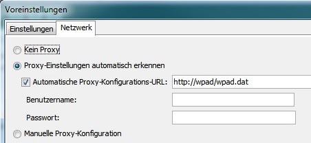

# NodeMCU tutorials

## Install Arduino IDE

Just follow these steps 1-4 to install arduino IDE on Windows: 

[NodeMCU ESP8266 Tutorial](http://www.mikrocontroller-elektronik.de/nodemcu-esp8266-tutorial-wlan-board-arduino-ide/)

Step 5 (lua installation) isn't needed for C-programming and these tutorials.

If you have a proxy at home, school or company you have to set it - e.g. for networks with automatic proxy configuration:

## Attach NodeMCU

Connect your NodeMCU ESp8266 board via USB - Windows will ask for installing some drivers.

Start your Arduino IDE after all drivers are installed.

## Set board and com port

Choose board model "NodeMCU ESP12E" and the com port of the serial to usb driver - mostly COM3 or - like in the example screenshot shown below - a higher com port.

